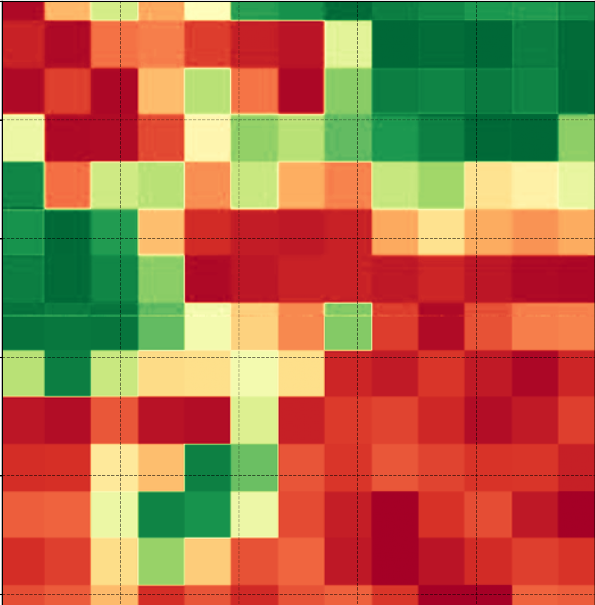

<div align="center">



# RasterViz

**Scientific Raster Visualization Plugin for QGIS**

*Publication-quality raster figures — styled after `rasterio.show()` — without leaving QGIS.*

[](https://github.com/Defani/QRasterVIZ/releases)
[](https://qgis.org)
[](LICENSE)
[](https://python.org)
[](https://plugins.qgis.org)

[Installation](#installation) · [Quick Start](#quick-start) · [Features](#features) · [Colormaps](#colormap-library) · [Tutorial](#step-by-step-tutorial) · [Codebase](#codebase)

</div>

---

## Overview

QGIS native symbology is designed for cartographic layer management. Generating a **publication-ready scientific figure** — with a perceptually uniform colormap, pointed colorbar with annotated intermediate ticks, geographic coordinate labels, and consistent typography — still requires switching to a Python script or Jupyter notebook.

**RasterViz eliminates that context switch.**

The plugin embeds Matplotlib's `Qt5Agg` backend directly inside a QGIS dialog. Every figure it produces is visually and numerically identical to what a researcher would generate with `rasterio.show()`, but controlled entirely through a GUI with live preview.

```python
# What researchers had to do before RasterViz
import rasterio, matplotlib.pyplot as plt, numpy as np
src = rasterio.open("ndvi.tif")
arr = src.read(1).astype("float32")
arr[arr == src.nodata] = np.nan
vmin, vmax = np.nanpercentile(arr, 2), np.nanpercentile(arr, 98)
fig, ax = plt.subplots(figsize=(10, 8))
im = ax.imshow(arr, cmap="RdYlGn", vmin=vmin, vmax=vmax)
cb = fig.colorbar(im, ax=ax, extend="both")
cb.set_label("NDVI")
plt.savefig("ndvi.png", dpi=300)
```

> With RasterViz: open plugin → select layer → **READ DATA & RENDER** → adjust → **EXPORT**. No scripting required.

---

## Features

### Rendering Modes

| Mode | Description |
|---|---|
| **Single Band — Continuous** | Renders one raster band with a configurable colormap and stretch |
| **Discrete / Classified** | Maps unique gridcodes to individual colours with labelled patch legend |
| **RGB Three-Band Composite** | Combines three bands with independent per-channel stretch |

### Stretch Control

- **Actual Min–Max** — maps the true data range without clipping
- **Percentile** — configurable lower/upper percentile (default 2nd–98th)
- **Manual Min–Max** — explicit `vmin` / `vmax` for reproducible cross-date figures

### Colormap System

- **24 domain-specific custom palettes** registered at startup
- **Full Matplotlib library** (~60 named colormaps) via the same ◀ ▶ cycler
- Inline ramp preview, **Reverse** toggle
- All palettes registered via `plt.colormaps` — available anywhere in QGIS


https://github.com/user-attachments/assets/fdb1e943-984a-4fb1-9cbb-ae0d25aff278


### Colorbar

- Orientation: horizontal or vertical
- End style: **Both Pointed · Right Pointed · Left Pointed · Box**
- Label position: top · bottom · left · right
- Independent **Bold** toggles for label and tick labels
- Configurable position, length, thickness, label text, label/tick sizes, tick count, tick decimal places, padding
- Orientation-aware geometry: *Length* = long axis, *Thickness* = short axis (corrected from earlier versions)

### Discrete Legend

- **Auto-scan gridcodes** with one click
- Per-class colour (swatch + hex), editable label, decimal places
- **Show / hide gridcode value** toggle (`Mangrove` vs `Mangrove (1)`)
- Symbol shape: Box or Circle
- Alignment: left · center · right
- Label padding, multi-column layout (1–10 columns)
- Nodata colour with alpha channel support

### Coordinate Labels

| Format | Example |
|---|---|
| DMS | `106°49'0.0" E` |
| DM | `106°49.000' E` |
| D (Decimal Degree) | `106.8167° E` |
| Default (UTM / Metre) | `476234.0000` |

- X-axis and Y-axis label rotation independent (0–360°)
- X and Y tick count (2–20), font size, decimal places
- Grid line style: Solid · Dashed · Dotted

### Interactive Drag System

Activate **✋ Drag Elements** in the top toolbar. Then drag:

- Continuous colorbar
- Discrete legend
- Map title
- Subtitle
- Any custom text element

Dragging updates spinbox values live; editing spinboxes repositions elements.

### Text System

- Map title with bold toggle and font size
- Subtitle below title, independent size and bold
- **➕ Add Text** — places a draggable free-text element anywhere on the figure

### Layout Series

Generates a single figure with N×M sub-maps:

- Rows and columns 1–6 each
- Per-slot: layer, band, colormap, stretch, title, colorbar fraction/pad
- Global: H/W spacing, margins, figure dimensions (inches)
- Optional overall super-title
- Assembled via `matplotlib.gridspec.GridSpec`

### Export

| Format | DPI | Use case |
|---|---|---|
| PNG | 300 | Journal submission |
| TIFF | 300 | Lossless archive |
| SVG | 150 | Poster / slide (vector) |
| PDF | 150 | Print (vector) |

---

## Colormap Library

### Custom Domain-Specific Palettes

| Palette | Domain |
|---|---|
| `NDVI_Custom` | NDVI / vegetation — white → brown → yellow → dark green |
| `RdYlGn_Custom` | Diverging vegetation health |
| `Custom_BlkRdYlGn` | High-contrast NDVI for dark backgrounds |
| `YlGn_Custom` | Canopy cover, leaf area index |
| `Red2Green` | Stress-to-health gradient |
| `Brown2Green` | Soil-to-vegetation transition |
| `Mangrove` | Mangrove canopy density |
| `Carbon_Stock` | Biomass / carbon — yellow → dark brown |
| `SAR_Backscatter` | SAR intensity — dark → bright |
| `Water` | Water depth / turbidity |
| `Ocean_Deep` | Bathymetry |
| `Urban` | LULC — vegetation → built-up |
| `Agriculture` | Cropland |
| `Terrain_Custom` | Elevation / DEM |
| `RdBu_Custom` | Diverging anomaly maps |
| `Spectral_Custom` | General spectral |
| `Blues_Custom` | Rainfall / moisture |
| `Viridis_Custom` | Perceptually uniform |
| `Magma_Custom` | Perceptually uniform (dark → bright) |
| `Inferno_Custom` | Perceptually uniform (high contrast) |
| `Plasma_Custom` | Perceptually uniform (purple → yellow) |
| `Cividis_Custom` | CVD-safe |
| `Greys_Custom` | Panchromatic / grayscale |
| `Rainbow_Custom` | Multi-class thematic (use sparingly) |

All palettes available in reversed form via **Reverse** toggle.

---

## Dependencies

No additional `pip install` required. All packages ship with standard QGIS.

| Package | Role | Bundled |
|---|---|---|
| **PyQGIS** | Layer access, raster provider, GUI integration | ✅ |
| **PyQt5** | Dialog, widget, layout construction | ✅ |
| **NumPy** | Array operations, stretch, RGBA assembly | ✅ |
| **Matplotlib** | Figure rendering, colormap, colorbar, tick formatting | ✅ |
| `os` | File path resolution | ✅ stdlib |

Matplotlib sub-modules used: `pyplot`, `colors`, `ticker`, `patches`, `gridspec`, `lines`, `backends.backend_qt5agg`.

---

## Installation

### Requirements

- QGIS **≥ 3.0**
- Python **≥ 3.6** (included with QGIS)
- NumPy and Matplotlib (bundled in QGIS)

### Option 1 — Plugin Manager *(pending approval)*

1. **Plugins → Manage and Install Plugins → All**
2. Search **RasterViz** → **Install Plugin**
3. Access via **Raster → QRVIZ → RasterViz**

### Option 2 — Install from ZIP

1. Download from [Releases](https://github.com/Defani/QRasterVIZ/releases)
2. **Plugins → Manage and Install Plugins → Install from ZIP**

### Option 3 — Source

```bash
git clone https://github.com/Defani/QRasterVIZ.git

# Windows (OSGeo4W)
cp -r QRasterVIZ %APPDATA%\QGIS\QGIS3\profiles\default\python\plugins\rasterviz

# Linux
cp -r QRasterVIZ ~/.local/share/QGIS/QGIS3/profiles/default/python/plugins/rasterviz

# macOS
cp -r QRasterVIZ "~/Library/Application Support/QGIS/QGIS3/profiles/default/python/plugins/rasterviz"
```

Then: **Plugins → Installed** → tick **RasterViz**.

---

## Quick Start

```
1. Raster → QRVIZ → RasterViz
2. OPEN RASTER FILE  or select loaded layer
3. Set band number
4. READ DATA & RENDER
5. Adjust colormap, stretch, colorbar — canvas updates live
6. 💾 EXPORT → choose format
```

---

## Step-by-Step Tutorial

### 1. Open a Raster Layer

Load a GeoTIFF (e.g. Sentinel-2 NDVI) into QGIS. In the plugin's **Layer & Band** group, select the layer or click **OPEN RASTER FILE**. Set **Band: 1** and click **READ DATA & RENDER**.

> The raster is read via `QgsRasterDataProvider.block()`, downsampled to **Max pixels (k)** for GUI responsiveness, and cached as a `float64` array. All subsequent changes re-render from cache — no disk re-read.

### 2. Configure Stretch

| Mode | When to use |
|---|---|
| **Actual Min–Max** | Pre-scaled data (NDVI −1 to 1) |
| **Percentile** | Most remote sensing data — clips outliers |
| **Manual** | Reproducible cross-date comparison |

For NDVI: Percentile, `Pmin = 2`, `Pmax = 98`.

### 3. Choose a Colormap

Use **◀ ▶** to cycle. Recommended:

| Data | Palette |
|---|---|
| NDVI | `NDVI_Custom` or `RdYlGn_Custom` |
| Mangrove | `Mangrove` |
| Carbon / biomass | `Carbon_Stock` |
| SAR backscatter | `SAR_Backscatter` |
| Elevation | `Terrain_Custom` |
| General | `Viridis_Custom` |

### 4. Coordinate Labels

In **Map Geometry & Coordinates** (right panel):

| Setting | Value |
|---|---|
| Format | `D (Decimal Degree)` |
| Coord Decimals | `4` |
| X Tick Count | `5` |
| Y Tick Count | `5` |
| X-label Rotation | `45°` — prevents overlap |
| Y-label Rotation | `0°` — horizontal, easier to read |

### 5. Colorbar

In **Continuous Colorbar Layout**:

| Setting | Value |
|---|---|
| Orientation | `horizontal` |
| End Style | `Both Pointed` |
| Label Text | `NDVI` |
| Label Position | `Bottom` |
| Tick Count | `5` |
| Tick Decimals | `2` |
| Bold Label | ✅ |

> **Scientific rationale:** Crameri et al. (2020) establish that pointed colorbar extensions communicate clipped data ranges — a scientifically meaningful signal, not decoration. Intermediate tick labels eliminate the need for mental interpolation (Rougier et al. 2014).

### 6. Export

**💾 EXPORT** → PNG for journals (300 DPI), SVG/PDF for posters (vector).

### Discrete Mode

1. Select **Discrete** tab
2. **READ DATA & RENDER**
3. **SCAN GRIDCODES**
4. Per class: assign colour, edit label, set decimals
5. Toggle **Show Gridcode** as needed
6. Set symbol shape, alignment, columns in **Discrete Legend Layout**
7. Drag legend in **✋ Drag Elements** mode

### Layout Series

1. **Layout Series** tab → set Rows and Columns
2. **BUILD LAYOUT GRID**
3. Configure each slot (layer, band, colormap, stretch, title, colorbar)
4. Set spacing and figure size
5. **READ ALL & RENDER LAYOUT**
6. **EXPORT LAYOUT**

---

## Interface Reference


### Top Toolbar Controls

| Element | Function |
|---|---|
| **Title** field | Map title text |
| **Sub** field | Subtitle below title |
| **Font** selector | Font family for all text |
| **Size** spinbox | Title font size |
| **➕ Add Text** | Adds a draggable free-text element |
| **✋ Drag Elements** | Activates interactive drag mode (blue when on) |
| **💾 EXPORT** | Exports active tab — Single Map or Layout Series |

---

## Codebase

```
QRasterVIZ-main/
├── __init__.py       #    8 lines  QGIS classFactory entry point
├── qrviz.py          #   42 lines  QRVIZPlugin — initGui, unload, run
├── dialog.py         # 1,522 lines main dialog
│   ├── DiscreteClassRow      per-class colour / label / decimal widget
│   ├── LayoutSlotWidget      per-slot config row for layout series
│   └── QRVIZDialog           main QDialog
│       ├── _build_ui()                    top toolbar + tabs
│       ├── _build_single_map_tab()        3-column splitter layout
│       ├── _build_layout_series_tab()     left controls + right canvas
│       ├── _on_drag_press/motion/release  Matplotlib mouse drag system
│       ├── _render_continuous()           colormap + pointed colorbar
│       ├── _render_discrete()             RGBA class map + patch legend
│       ├── _render_rgb()                  3-band composite
│       ├── _draw_layout()                 GridSpec multi-map assembly
│       ├── _style_axes()                  rotation, formatters, grid
│       ├── _make_lon_formatter()          DMS/DM/DD/UTM closure
│       └── export_figure() / _export_layout()
├── colormaps.py      #  152 lines  palette registry
│   ├── CUSTOM_PALETTES    24 LinearSegmentedColormaps
│   └── COLORMAPS          master list (~60+ total)
├── metadata.txt      QGIS plugin metadata
├── icon.png          toolbar icon
└── LICENSE           GNU GPL v2 or later
```

**Total: 1,724 lines across 4 Python files.**

### Technical Notes

**Raster reading** via `QgsRasterDataProvider.block()` — respects CRS, nodata, and QGIS-side transforms. No separate `rasterio` or GDAL installation needed.

**Live preview** caches the NumPy `float64` array after first read. Parameter changes trigger `fig.clf()` and redraw from cache. No I/O on adjustment.

**Coordinate formatters** are closures returned by `_make_lon_formatter()` and `_make_lat_formatter()`, passed to `ax.xaxis.set_major_formatter(mticker.FuncFormatter(...))`.

**Colorbar geometry:** horizontal → `rect = [x, y, length, thickness]`; vertical → `rect = [x, y, thickness, length]`. *Length* always = long axis, *Thickness* = short axis.

---

## Scientific Rationale

**Perceptually uniform colormaps** are a scientific requirement. Crameri, Shephard & Heron (2020) demonstrate that non-uniform colormaps introduce artificial features and distort quantitative reading. The palettes `Viridis_Custom`, `Magma_Custom`, `Plasma_Custom`, `Inferno_Custom`, and `Cividis_Custom` are perceptually uniform and CVD-accessible.

**Pointed colorbars** communicate that data extends beyond the displayed range — scientifically significant information when percentile stretch is used.

**Annotated intermediate ticks** allow direct quantitative reading without mental interpolation between min and max.

### References

- Crameri, F., Shephard, G. E., & Heron, P. J. (2020). The misuse of colour in science communication. *Nature Communications*, **11**, 5444. https://doi.org/10.1038/s41467-020-19160-7
- Rougier, N. P., Droettboom, M., & Bourne, P. E. (2014). Ten simple rules for better figures. *PLOS Computational Biology*, **10**(9), e1003833. https://doi.org/10.1371/journal.pcbi.1003833
- Crameri, F. (2024). Choosing suitable color palettes for accessible and accurate science figures. *Current Protocols*. https://doi.org/10.1002/cpz1.1126


---

## License

GNU General Public License v2.0 or later. See [LICENSE](LICENSE).

Matplotlib and NumPy are distributed under the BSD License. PyQGIS and PyQt5 are distributed under the GNU GPL v2.

---

## Citation

```
Alfitriansyah, D. A. (2026). RasterViz: Scientific Raster Visualization Plugin for QGIS
(Version 1.1.0) [Software]. https://github.com/Defani/QRasterVIZ
```

---

<div align="center">

Built with **PyQGIS · NumPy · Matplotlib · PyQt5**

[github.com/Defani/QRasterVIZ](https://github.com/Defani/QRasterVIZ)

</div>
